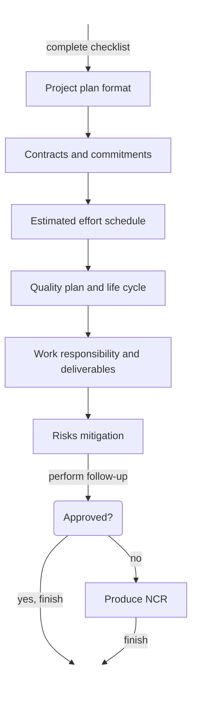
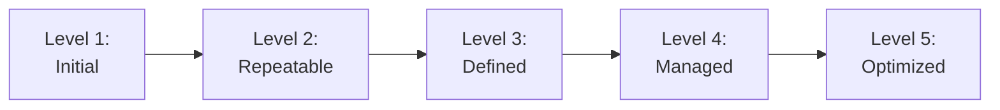

<!-- KaTeX -->

<!-- Mermaid -->

# [Mid exam](https://github.com/hanggrian/IIT-CS587/blob/assets/assignments/exam1.pdf)

## Problem 1

> Can the budgeted cost work scheduled and performed be used in predicting the
  completion of the project? Explain.

The budgeted cost of work scheduled (BCWS) and budgeted cost of work performed
(BCWP) can be used to predict schedule variance (SV). SV is the difference
between the planned and actual progress of the project. In a cost schedule
control diagram, the SV is calculated using the BCWS and BCWP of the same time
frame.

## Problem 2

> Explain the difference between reviews and audits within the context of
  software project management and the software development process.

Reviews, such as Formal Group Review and Desk Review, are performed internally
by technical staff technical to diagnose defects. In a software project, the
defects ranged from requirement specifications, design documents and code
implementation. There are four stages in a review process:

Audits, on the other hand, are conducted by an independent organization to
evaluate the project's compliance instead of product defects or individual work.
By adhering to the standards, the software project maintains its integrity and
perceived quality. The audit process follows a checklist and a follow-up:

## Problem 3

> When building the project network diagram, can we schedule the testing phase
  to start after the design phase? Explain.

It is not practical to schedule the testing phase to start after the design
phase. According to the software quality assurance (SQA) process, the testing
phase depends on the completion of implementation, which is the result of the
design phase. Logically speaking, there is no code to test without the
implementation.

## Problem 4

> For a software development organization that is CMM level-3, which method can
  be used for estimating activity effort/duration? Explain.

The capability maturity model (CMM) is a framework to assess a project's
completion and quality. At CMM level-3, the project is expected to have
**defined** organization process, software engineering standards, training
materials and other resources. These key process areas (KPA) can be used to
estimate effort and duration in a work breakdown structure (WBS).

## Problem 5

> Who controls the design review meeting? What are the different metrics
  collected in the requirements review meeting?

The review meeting is controlled by the **moderator,** who is also responsible
for producing review reports, logging meeting sessions and collecting concerns
from participants. During the review meeting, **effort data** and
**defect data** are collected for review capability baseline (RCB). In the RCB,
executed processes are evaluated by either the moderator or the project manager.

## Problem 6

> From the perspective of software project management, software artifact
  review/inspection is only one aspect to ensure the quality of the software
  produced, Explain.

Software artifact review is only one aspect of verification and validation
(V&V) in software project management. Beside requirement and design reviews, the
V&V states that the software should be planned, implemented and tested in
accordance with the specifications. The goal of iterative V&V is to refine the
quality of a software product.

## Problem 7

> What are the constraints that may influence whether we can partition an
  activity or not?

A task can be partitioned when the work can be assigned to multiple people in
parallel. In contrast to a partitionable task, a sequantial task must complete
its dependencies before it can be executed, making it unsuitable for work
balancing. It is also important to consider the **crashpoint** of a task, which
diminishes the productivity when the task is over partitioned.

## Problem 8

> What are the possible actions that the project manager and moderator might
  consider to take for the following outcomes of code inspections?
>
> 1.  Rework and bug fixes turned out to require more than 50% of the original
      effort to write the code.

Since 50% of the original effort marks a significant workload and disruption to
the schedule, it is appropriate to raise the **Out of Control** flag, the
highest SQA severity level.

- **Project manager:** Given the major rework, it is safe to say that the
  current team has failed to meet the quality standards. The project manager
  should evaluate the team's performance, consider reassigning tasks or
  reallocating budget before proceeding with the project.
- **Moderator:** Immediate call for a review meeting to discuss the rework and
  identify the root cause of the issue. Most importantly, the existing team
  should be aware of the issue severity and the urgency to improve their
  performance.

> 2.  Rework and bug fixes turned out to require 15% to 20% of the original
      effort to write the code.

The project manager should raise the **Under Control** flag because 15&ndash;20%
of rework represents a moderate workload but is still in a manageable state.

- **Project manager:** Depending on the schedule, the project manager may
  consider reassigning resources from other tasks to help with the rework.
  The project manager may also closely monitor the rework progress to evaluate
  the team's performance.
- **Moderator:** The moderator should bring the issue to everyone's
  attention during the next review meeting. Additional review meetings may be
  necessary when critical defects are not yet resolved.

> 3.  Rework and bug fixes turned out to require less than 5% of the original
      effort to write the code.

5% of the original effort suggests that the rework is minor and should not
disrupt the overall schedule. In other words, **On Track.**

- **Project manager:** Knowing that the project is on track, the project manager
  can celebrate the team's success while keeping an eye on the rework progress.
- **Moderator:** A review meeting may not be necessary, but the moderator's job
  to log the rework and bug fixes is still important.

## Problem 9

> Consider the following milestone table, what is the milestone trend chart that
  the following project follows? Name and draw the milestone trend chart.
>
> Milestone | Expected delivery | Actual delivery
> --- | --- | ---
> Project planning | 1st month | on-time
> Requirement phase | 2nd month | early 1 week
> Analysis phase | 3rd month | early 1 week
> Design phase | 4th month | early 1 week
> Coding | 5th month | early 2 weeks
> Unit testing | 6th month | early 2 weeks
> Integration testing | 7th month | early 2 weeks
> Documentation | 8th month | early 3 weeks
> Installation/training | 9th month | early 3 weeks

Considering every milestone is delivered earlier than expected, the project
follows the **Successive Runs** trend. The project must not experience any
permanent delays to categorize in this trend. Given that the resources are not
stretched for the remainder of the project, the project manager can expect
approximately 3 months early delivery.

## Problem 10

> Consider the following data; calculate the effort and duration required for
  every task, considering the following constraints:
>
> 1.  An artifact is produced by only one author.
> 1.  Every review "meeting" task shall be carried by 5 engineers including the
      author.
> 1.  Every review "preparation" task shall be carried by 4 engineers excluding
      the author.
> 1.  Any "Rework" task can be executed by the author of the original task.
>
> Task | Amount of work | Productivity | Effort | Duration
> --- | --- | --- | --- | ---
> **High Level Design (HLD)** | | | |
> &emsp;Write HLD document | 136 pages | 2 pages/hour | |
> &emsp;**Review HLD document** | | | |
> &emsp;&emsp;Preparation for HLD document | | 4 pages/hour | |
> &emsp;&emsp;Review meeting | | 6 pages/hour | |
> &emsp;Rework | 24 defects | 2 defects/hour | |
> **Low Level Design (LLD)** | | | |
> &emsp;Write LLD document | 76 pages | 2 pages/hour | |
> &emsp;**Review LLD document** | | | |
> &emsp;&emsp;Preparation for LLD document | | 3 pages/hour | |
> &emsp;&emsp;Review meeting | | 6 pages/hour | |
> &emsp;Rework | 43 defects | 1 defect/hour | |
> **Testing** | |
> &emsp;Write test plan | 102 pages | 5 pages/hour | |
> &emsp;**Review test plan** | |
> &emsp;&emsp;Preparation for test plan | | 10 pages/hour | |
> &emsp;&emsp;Review meeting | | 15 pages/hour | |
> &emsp;Rework | 35 defects | 4 defects/hour | |

Task | Effort | Duration
--- | ---: | ---:
**High Level Design (HLD)** | |
&emsp;Write HLD document | $136\ \textsf{pages} / 2\ \frac{\textsf{pages}}{\textsf{h}} = \mathbf{68}\ \textbf{h}$ | $/ 1\ \textsf{person} = \mathbf{68}\ \textbf{h}$
&emsp;**Review HLD document** | |
&emsp;&emsp;Preparation for HLD document | $136\ \textsf{pages} / 4\ \frac{\textsf{pages}}{\textsf{h}} = \mathbf{34}\ \textbf{h}$ | $/ 4\ \textsf{people} = \mathbf{8.5}\ \textbf{h}$
&emsp;&emsp;Review meeting | $136\ \textsf{pages} / 6\ \frac{\textsf{pages}}{\textsf{h}} = \mathbf{22.67}\ \textbf{h}$ | $/ 5\ \textsf{people} = \mathbf{4.53}\ \textbf{h}$
&emsp;Rework | $24\ \textsf{defects} / 2\ \frac{\textsf{defects}}{\textsf{h}} = \mathbf{12}\ \textbf{h}$ | $/ 1\ \textsf{person} = \mathbf{12}\ \textbf{h}$
**Low Level Design (LLD)** | |
&emsp;Write LLD document | $76\ \textsf{pages} / 2\ \frac{\textsf{pages}}{\textsf{h}} = \mathbf{38}\ \textbf{h}$ | $/ 1\ \textsf{person} = \mathbf{38}\ \textbf{h}$
&emsp;**Review LLD document** | |
&emsp;&emsp;Preparation for LLD document | $76\ \textsf{pages} / 3\ \frac{\textsf{pages}}{\textsf{h}} = \mathbf{25.33}\ \textbf{h}$ | $/ 4\ \textsf{people} = \mathbf{6.33}\ \textbf{h}$
&emsp;&emsp;Review meeting | $76\ \textsf{pages} / 6\ \frac{\textsf{pages}}{\textsf{h}} = \mathbf{12.67}\ \textbf{h}$ | $/ 5\ \textsf{people} = \mathbf{2.53}\ \textbf{h}$
&emsp;Rework | $43\ \textsf{defects} / 1\ \frac{\textsf{defect}}{\textsf{h}} = \mathbf{43}\ \textbf{h}$ | $/ 1\ \textsf{person} = \mathbf{43}\ \textbf{h}$
**Testing** | |
&emsp;Write test plan | $102\ \textsf{pages} / 5\ \frac{\textsf{pages}}{\textsf{h}} = \mathbf{20.4}\ \textbf{h}$ | $/ 1\ \textsf{person} = \mathbf{20.4}\ \textbf{h}$
&emsp;**Review test plan** | |
&emsp;&emsp;Preparation for test plan | $102\ \textsf{pages} / 10\ \frac{\textsf{pages}}{\textsf{h}} = \mathbf{10.2}\ \textbf{h}$ | $/ 4\ \textsf{people} = \mathbf{2.55}\ \textbf{h}$
&emsp;&emsp;Review meeting | $102\ \textsf{pages} / 15\ \frac{\textsf{pages}}{\textsf{h}} = \mathbf{6.8}\ \textbf{h}$ | $/ 5\ \textsf{people} = \mathbf{1.36}\ \textbf{h}$
&emsp;Rework | $35\ \textsf{defects} / 4\ \frac{\textsf{defects}}{\textsf{h}} = \mathbf{8.75}\ \textbf{h}$ | $/ 1\ \textsf{person} = \mathbf{8.75}\ \textbf{h}$
