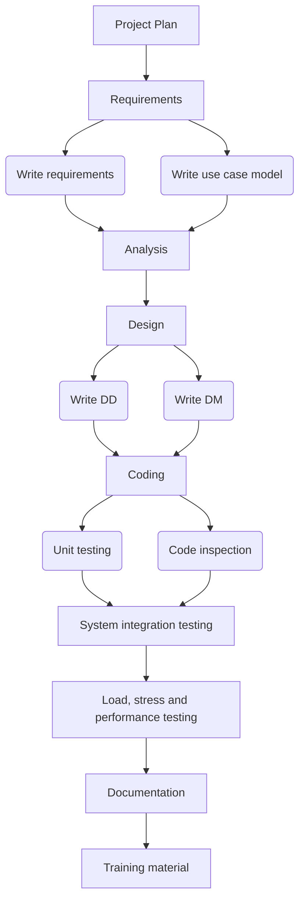

<!-- KaTeX -->

<!-- Mermaid -->

# [Homework 1](https://github.com/hanggrian/IIT-CS587/blob/assets/assignments/hw1.pdf)

## Problem 1

> Feed the information provided in this handout in MS Project to create the
  Project Plan and the Network Diagram.

Below is the tasks with their durations calculated based on the information
provided in the handout. Indentation is used to indicate the hierarchy of tasks.
Task groups are indicated with **bold** text, they do not have assigned
resources or durations.

Task | Duration
--- | ---:
**Project plan** |
&emsp;Write plan | $187\ \textsf{pages} / 5\ \frac{\textsf{pages}}{\textsf{h}} = 37.4\ \textsf{h}$
&emsp;**Review plan** |
&emsp;&emsp;Preparation for review | $187\ \textsf{pages} / 4\ \frac{\textsf{pages}}{\textsf{h}} = 46.75\ \textsf{h}$
&emsp;&emsp;Review meeting | $187\ \textsf{pages} / 5\ \frac{\textsf{pages}}{\textsf{h}} = 37.4\ \textsf{h}$
&emsp;&emsp;Rework | $71\ \textsf{defects} / 5\ \frac{\textsf{defects}}{\textsf{h}} = 14.2\ \textsf{h}$
**Requirements** |
&emsp;Write requirements | $156\ \textsf{Req} / 5\ \frac{\textsf{Req}}{\textsf{h}} = 31.2\ \textsf{h}$
&emsp;Write Use Case Model | $76\ \textsf{Use Cases} / 5\ \frac{\textsf{Use Cases}}{\textsf{h}} = 15.2\ \textsf{h}$
&emsp;**Review requirements** |
&emsp;&emsp;Preparation for review | $156\ \textsf{Req} / 8 \frac{\textsf{Req}}{\textsf{h}} + 76\ \textsf{Use Cases} / 4\ \frac{\textsf{Use Cases}}{\textsf{h}} = 19.5 \textsf{h} + 19 \textsf{ h} = 38.5 \textsf{ h}$
&emsp;&emsp;Review meeting | $156\ \textsf{Req} / 8\ \frac{\textsf{Req}}{\textsf{h}} + 76\ \textsf{Use Cases} / 12\ \frac{\textsf{Use Cases}}{\textsf{h}} = 19.5\ \textsf{h} + 6.58\ \textsf{h} = 26.08\ \textsf{h}$
&emsp;Rework | $97\ \textsf{defects} / 5\ \frac{\textsf{defects}}{\textsf{h}} = 19.4\ \textsf{h}$
**Analysis** |
&emsp;Write analysis document | $48\ \textsf{pages} / 5\ \frac{\textsf{pages}}{\textsf{h}} = 9.6\ \textsf{h}$
&emsp;**Review analysis document** |
&emsp;&emsp;Preparation for analysis document | $48\ \textsf{pages} / 5\ \frac{\textsf{pages}}{\textsf{h}} = 9.6\ \textsf{h}$
&emsp;&emsp;Review meeting | $48\ \textsf{pages} / 8 \frac{\textsf{pages}}{\textsf{h}} = 6\ \textsf{h}$
&emsp;Rework | $66\ \textsf{defects} / 4\ \frac{\textsf{defects}}{\textsf{h}} = 16.5\ \textsf{h}$
**Design** |
&emsp;Write DD | $134\ \textsf{pages} / 5\ \frac{\textsf{pages}}{\textsf{h}} = 26.8\ \textsf{h}$
&emsp;**Review DD** |
&emsp;&emsp;Preparation for DD | $134\ \textsf{pages} / 3\ \frac{\textsf{pages}}{\textsf{h}} = 44.67\ \textsf{h}$
&emsp;&emsp;Review meeting | $134\ \textsf{pages} / 6\ \frac{\textsf{pages}}{\textsf{h}} = 22.33\ \textsf{h}$
&emsp;Rework | $88\ \textsf{defects} / 5\ \frac{\textsf{defects}}{\textsf{h}} = 17.6\ \textsf{h}$
&emsp;Write Data Model | $69\ \textsf{pages} / 1\ \frac{\textsf{pages}}{\textsf{h}} = 69\ \textsf{h}$
&emsp;**Review DM** |
&emsp;&emsp;Preparation for DM | $69\ \textsf{pages} / 3\ \frac{\textsf{pages}}{\textsf{h}} = 23\ \textsf{h}$
&emsp;&emsp;Review meeting | $69\ \textsf{pages} / 5\ \frac{\textsf{pages}}{\textsf{h}} = 13.8\ \textsf{h}$
&emsp;Rework | $94\ \textsf{defects} / 5\ \frac{\textsf{defects}}{\textsf{h}} = 18.8\ \textsf{h}$
**Coding and unit test** |
&emsp;Write code | $3450\ \textsf{SLOC} / 10\ \frac{\textsf{SLOC}}{\textsf{h}} = 345\ \textsf{h}$
&emsp;**Unit testing** |
&emsp;&emsp;Prepare/execute test cases | $174\ \textsf{test cases} / 5\ \frac{\textsf{test cases}}{\textsf{h}} = 34.8\ \textsf{days}$
&emsp;&emsp;Fix found defects | $104\ \textsf{defects} / 4\ \frac{\textsf{defects}}{\textsf{h}} = 26\ \textsf{days}$
&emsp;&emsp;Test dixed defects | $104\ \textsf{defects} / 5\ \frac{\textsf{defects}}{\textsf{h}} = 20.8\ \textsf{days}$
&emsp;**Code inspection** |
&emsp;&emsp;Preparation for code inspection | $3450\ \textsf{SLOC} / 110\ \frac{\textsf{SLOC}}{\textsf{h}} = 31.36\ \textsf{h}$
&emsp;&emsp;Code inspection meeting | $3450\ \textsf{SLOC} / 160\ \frac{\textsf{SLOC}}{\textsf{h}} = 21.56\ \textsf{h}$
&emsp;&emsp;Rework | $309\ \textsf{defects} / 5\ \frac{\textsf{defects}}{\textsf{h}} = 61.8\ \textsf{h}$
&emsp;**System integration testing** |
&emsp;&emsp;Write test plan | $149\ \textsf{pages} / 5\ \frac{\textsf{pages}}{\textsf{day}} = 29.8\ \textsf{days}$
&emsp;&emsp;**Review TP** |
&emsp;&emsp;&emsp;Preparation for TP | $149\ \textsf{pages} / 5\ \frac{\textsf{pages}}{\textsf{h}} = 29.8\ \textsf{h}$
&emsp;&emsp;&emsp;Review TP meeting | $149\ \textsf{pages} / 6\ \frac{\textsf{pages}}{\textsf{h}} = 24.83\ \textsf{h}$
&emsp;&emsp;&emsp;Rework | $99\ \textsf{defects} / 4\ \frac{\textsf{defects}}{\textsf{h}} = 24.75\ \textsf{h}$
&emsp;&emsp;Execute TP | $138\ \textsf{test cases} / 30\ \frac{\textsf{test cases}}{\textsf{day}} = 4.6\ \textsf{days}$
&emsp;&emsp;Fix found defects | $77\ \textsf{defects} / 4\ \frac{\textsf{defects}}{\textsf{day}} = 19.25\ \textsf{days}$
&emsp;&emsp;Test fixed defects | $77\ \textsf{defects} / 10\ \frac{\textsf{defects}}{\textsf{day}} = 7.7\ \textsf{days}$
&emsp;**Load, stress and performance Testing** |
&emsp;&emsp;Write test plan | $201\ \textsf{pages} / 4\ \frac{\textsf{pages}}{\textsf{day}} = 50.25\ \textsf{days}$
&emsp;&emsp;**Review TP** |
&emsp;&emsp;&emsp;Preparation for TP | $201\ \textsf{pages} / 3\ \frac{\textsf{pages}}{\textsf{h}} = 67\ \textsf{h}$
&emsp;&emsp;&emsp;Review TP meeting | $201\ \textsf{pages} / 6\ \frac{\textsf{pages}}{\textsf{h}} = 33.5\ \textsf{h}$
&emsp;&emsp;&emsp;Rework | $88\ \textsf{defects} / 3\ \frac{\textsf{defects}}{\textsf{h}} = 29.33\ \textsf{h}$
&emsp;&emsp;Execute TP | $192\ \textsf{test cases} / 10\ \frac{\textsf{test cases}}{\textsf{day}} = 19.2\ \textsf{days}$
&emsp;&emsp;Fix found defects | $74\ \textsf{defects} / 5\ \frac{\textsf{defects}}{\textsf{day}} = 14.8\ \textsf{days}$
&emsp;&emsp;Test fixed defects | $74\ \textsf{defects} / 8\ \frac{\textsf{defects}}{\textsf{day}} = 9.25\ \textsf{days}$
&emsp;**Documentation** |
&emsp;&emsp;User documentation | $141\ \textsf{pages} / 5\ \frac{\textsf{pages}}{\textsf{h}} = 28.2\ \textsf{h}$
&emsp;&emsp;**Review UD** |
&emsp;&emsp;&emsp;Preparation for UD Review | $141\ \textsf{pages} / 4\ \frac{\textsf{pages}}{\textsf{h}} = 35.25\ \textsf{h}$
&emsp;&emsp;&emsp;Review UD meeting | $141\ \textsf{pages} / 10\ \frac{\textsf{pages}}{\textsf{h}} = 14.1\ \textsf{h}$
&emsp;&emsp;&emsp;Rework | $203\ \textsf{defects} / 10\ \frac{\textsf{defects}}{\textsf{h}} = 20.3\ \textsf{h}$
&emsp;**Training material** |
&emsp;&emsp;Tutorial | $266\ \textsf{pages} / 4\ \frac{\textsf{pages}}{\textsf{h}} = 66.5\ \textsf{h}$
&emsp;&emsp;**Review tutorial** |
&emsp;&emsp;&emsp;Preparation for tutorial review | $266\ \textsf{pages} / 5\ \frac{\textsf{pages}}{\textsf{h}} = 53.2\ \textsf{h}$
&emsp;&emsp;&emsp;Review tutorial meeting | $266\ \textsf{pages} / 10\ \frac{\textsf{pages}}{\textsf{h}} = 26.6\ \textsf{h}$
&emsp;&emsp;&emsp;Rework | $168\ \textsf{defects} / 10\ \frac{\textsf{defects}}{\textsf{h}} = 16.8\ \textsf{h}$

## Problem 2

> Create a WBS with the required phases and activities to complete this project.

Below is the work breakdown structure in a list format. Subtasks indicate
simultaneous activities that can be performed in parallel, the subsequent task
can only start after all subtasks are completed.

1.  **Project plan:** Write plan
1.  **Project plan/Review plan:** Preparation for review
1.  **Project plan/Review plan:** Review meeting
1.  **Project plan/Review plan:** Rework
1.  **Requirements:**
    - Write requirements
    - Write use case model
1.  **Requirements/Review requirements:** Preparation for review
1.  **Requirements/Review requirements:** Rework
1.  **Analysis:** Write analysis document
1.  **Analysis/Review analysis document:** Preparation for review
1.  **Analysis/Review analysis document:** Review meeting
1.  **Analysis/Review analysis document:** Rework
1.  **Design:** Write DD, Write DM
1.  **Design:**
    - **Review DD:** Preparation for DD
    - **Review DM:** Preparation for DM
1.  **Design:**
    - **Review DD:** Review meeting
    - **Review DM:** Review meeting
1.  **Design:**
    - **Review DD:** Rework
    - **Review DM:** Rework
1.  **Coding and unit test:** Write code
1.  **Coding and unit test:**
    - **Unit testing:** Prepare/Execute test cases
    - **Code inspection:** Preparation for code inspection
1.  **Coding and unit test:**
    - **Unit testing:** Fix found defects
    - **Code inspection:** Code inspection meeting
1.  **Coding and unit test:**
    - **Unit testing:** Test fixed defects
    - **Code inspection:** Rework
1.  **System integration testing:** Write test plan
1.  **System integration testing:** Preparation for TP
1.  **System integration testing:** Review TP Meeting
1.  **System integration testing:** Rework
1.  **System integration testing:** Execute TP
1.  **System integration testing:** Fix found defects
1.  **System integration testing:** Test fixed defects
1.  **Load, stress and performance testing:** Write test plan
1.  **Load, stress and performance testing:** Preparation for TP
1.  **Load, stress and performance testing:** Review TP Meeting
1.  **Load, stress and performance testing:** Rework
1.  **Load, stress and performance testing:** Execute TP
1.  **Load, stress and performance testing:** Fix found defects
1.  **Load, stress and performance testing:** Test fixed defects
1.  **Documentation:** User documentation
1.  **Documentation:** Preparation for UD review
1.  **Documentation:** Review UD meeting
1.  **Documentation:** Rework
1.  **Training material:** Tutorial
1.  **Training material:** Preparation for tutorial review
1.  **Training material:** Review tutorial meeting
1.  **Training material:** Rework

The network diagram is as follows:

## Problem 3

> Assign the Resources to the Tasks making any assumptions you consider
  appropriate (Your assumptions should be based on Software Engineering
  Assumptions).

Task | Resource | Note
--- | --- | ---
**Project plan** | |
&emsp;Write plan | PM3
&emsp;**Review plan** | |
&emsp;&emsp;Preparation for review | PM4, PM5, RE1, SE1, DE1, PE1, TE1 | PM3 absent
&emsp;&emsp;Review meeting | PM3, DE105, PE7, RE2, SE2, TE2 | PM3 returns
&emsp;&emsp;Rework | PM3
**Requirements** | |
&emsp;Write requirements | RE1, RE2
&emsp;Write use case model | RE7, RE8
&emsp;**Review requirements** | |
&emsp;&emsp;Preparation for review | RE102, RE103, RE117, RE118 | RE1, RE2, RE7 absent
&emsp;&emsp;Review meeting | RE1, RE2, RE7, RE103, RE119 | RE1, RE2, RE7 returns
&emsp;Rework | RE1, RE2, RE7
**Analysis** | |
&emsp;Write analysis document | SE1, SE2
&emsp;**Review analysis document** | |
&emsp;&emsp;Preparation for analysis document | SE7, SE8, SE204, SE205 | SE1, SE2 absent
&emsp;&emsp;Review meeting | SE1, SE2, SE7, SE205, SE501 | SE1, SE2 returns
&emsp;Rework | SE1, SE2
**Design** | |
&emsp;Write DD | SE7, SE8
&emsp;**Review DD** | |
&emsp;&emsp;Preparation for DD | SE9, SE204, SE205, SE501 | SE7, SE8 absent
&emsp;&emsp;Review meeting | SE1, SE2, SE7, SE8, SE9 | SE7, SE8 returns
&emsp;Rework | SE7, SE8
&emsp;Write DM | SE204, SE205
&emsp;**Review DM** | |
&emsp;&emsp;Preparation for DM | SE1, SE2, SE7, SE9 | SE204, SE205 absent
&emsp;&emsp;Review meeting | SE8,SE9,SE204,SE205,SE501 | SE204, SE205 returns
&emsp;Rework | SE204, SE205
**Coding and unit test** | |
&emsp;Write code | PE1, PE7, PE8, PE9
&emsp;**Unit testing** | |
&emsp;&emsp;Prepare/execute test cases | TE1, TE2
&emsp;&emsp;Fix found defects | PE1, PE202
&emsp;&emsp;Test fixed defects | TE3, TE4
&emsp;**Code inspection** | |
&emsp;&emsp;Preparation for code inspection | PE7, PE8, PE203, PE205 | PE1, PE7 absent
&emsp;&emsp;Code inspection meeting | PE1, PE7, PE10, PE203, PE202 | PE1, PE7 returns
&emsp;&emsp;Rework | PE1, PE7
&emsp;**System integration testing** | |
&emsp;&emsp;Write test plan | TE1, TE2
&emsp;&emsp;**Review TP** | |
&emsp;&emsp;&emsp;Preparation for TP | TE3, TE4, TE302, TE404 | TE1, TE2 absent
&emsp;&emsp;&emsp;Review TP meeting | TE1, TE2403, TE404, TE405, TE2 | TE1, TE2 returns
&emsp;&emsp;&emsp;Rework | TE1, TE2
&emsp;&emsp;Execute TP | TE302, TE2403
&emsp;&emsp;Fix found defects | PE202, PE203
&emsp;&emsp;Test fixed defects | TE404, TE405
&emsp;**Load, stress and performance testing** | |
&emsp;&emsp;Write test plan | TE3, TE4
&emsp;&emsp;**Review TP** | |
&emsp;&emsp;&emsp;Preparation for TP | TE302, TE404, TE405, TE2403 | TE3, TE4 absent
&emsp;&emsp;&emsp;Review TP meeting | TE1, TE2, TE3, TE4, TE2403 | TE3, TE4 returns
&emsp;&emsp;&emsp;Rework | TE3, TE4
&emsp;&emsp;Execute TP | TE2, TE302
&emsp;&emsp;Fix found defects | PE9, PE10
&emsp;&emsp;Test fixed defects | TE2403, TE405
&emsp;**Documentation** | |
&emsp;&emsp;User documentation | DE1, DE105
&emsp;&emsp;**Review UD** | |
&emsp;&emsp;&emsp;Preparation for UD Review | DE203, DE204, DE205, DE206 | DE1, DE105 absent
&emsp;&emsp;&emsp;Review UD meeting | DE1, DE206, DE105, DE204, DE205 | DE1, DE105 returns
&emsp;&emsp;&emsp;Rework | DE1, DE105
&emsp;**Training material** | |
&emsp;&emsp;Tutorial | DE203 DE204
&emsp;&emsp;**Review tutorial** | |
&emsp;&emsp;&emsp;Preparation for tutorial review | DE1, DE105, DE205, DE206 | DE203, DE204 absent
&emsp;&emsp;&emsp;Review tutorial meeting | DE203, DE204, DE1, DE206, DE105 | DE203, DE204 returns
&emsp;&emsp;&emsp;Rework | DE203, DE204

## Problem 4

> What is the earliest finish date for this project if it is scheduled to start
  on **6/3/25?**

Based on the projection on Microsoft Project document, it is reasonable to
expect that the project will finish on **12/1/26,** approximately 18 months
after the start date.

## Problem 5

> Submit a single ZIP file that has MS-Project and PDF document report.

Included in this submission:

- Homework report: **hw1.md**
- Homework PDF conversion: **report.pdf**
- Microsoft Project file: **hw1.mpp**
- Microsoft Project PDF conversion: **output.pdf**

## Problem 6

> Submit your MS Project File.

All files are compressed in a single file **hw1.zip**

## Problem 7

> Create PDF Document Report that has the following:

  - WBS
  - Network Diagram
  - Answers to Question #4
