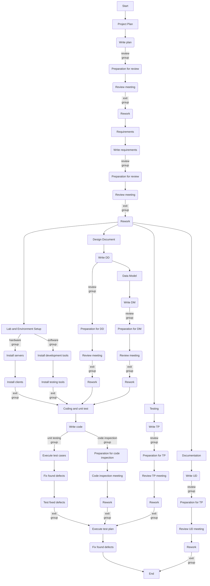

<!-- KaTeX -->

<!-- Mermaid -->

# [Homework 2](https://github.com/hanggrian/IIT-CS587/blob/assets/assignments/hw2.pdf): Analysis

> ## Resources
>
> **Important Note:** Use the same resources listed in Assignment#1; in essence,
  Assignment#1 project and Assignment#2 project will share the same resource
  pool. ONLY assign the needed resources to the tasks; for example writing
  project plan needs one manager of the available managers, however, you could
  use all available requirement engineers to work on writing the requirements.
>
> In addition to resources listed in Assignment #1, following resources have
  been added to the resource pool of available headcounts
>
> 1.  There are two project managers, PM8, PM12, PM13 available.
> 1.  There are two systems engineers, SE72, SE73, SE74 available.
> 1.  There are three programmers/software engineers PE735, PE736 available.
> 1.  There are three test engineers TE571, TE572, TE593 available.
>
> ## Assumptions
>
> 1.  Every review or inspection *meeting* task shall be carried by
      **5 engineers including ONE of the author(s).**
> 1.  Every review or inspection *preparation* task shall be carried by
      **4 engineers excluding the author(s).**
> 1.  Any *Rework* task can be executed by
      **one or all authors of the original task.**
> 1.  *Project Plan* shall be reviewed by at least
      **one engineer from every technical area.**
> 1.  *Data Model* can be created only by **system engineers** and can be
      reviewed by any engineer.
> 1.  *Lab and Environment Setup* tasks can be assigned and executed by
      **system engineers** only.
>
> ## Dependencies
>
> It is expected that you will find the correct task dependencies based on the
  material discussed during class and considering the following constraints:
>
> 1.  There is no technical task prior to requirement phase; project planning is
      not a technical task it is a managerial task.
> 1.  Analysis Activity can start as soon as requirement document is complete.
> 1.  Design activity can start as soon as Analysis document is complete.
> 1.  Data Model task can start when Detailed Design task finishes.
> 1.  Coding can start as soon as design is complete.
> 1.  Writing Test Plan can start as soon as requirements are complete.
> 1.  Executing Test Plan can start as soon as coding is complete.
> 1.  Documentation can start as soon as requirements are complete.
> 1.  Any other constraints that you might add, shall be documented.
      clearly when you submit your homework.

## Problem 1

> Assume it has been requested that this project be started on **6/10/25** after
  the project in Assignment #1 has been started on **6/3/25.** This project and
  the project in Homework #1 will use/share the same resources listed in
  Assignment #1.

Updated resources, new initials are highlighted in the table below:

Category | Initials
--- | ---
Project Managers | PM3, PM4, PM5, **PM8, PM12, PM13**
Requirement Engineers | RE1, RE2, RE7, RE8, RE102, RE103, RE117, RE118, RE119
System Engineers | SE1, SE2, SE7, SE8, SE9, **SE72, SE73, SE74** SE204, SE205, SE501
Programmers | PE1, PE7, PE8, PE9, PE10, PE202, PE203, PE205, **PE735, PE736**
Test Engineers | TE1, TE2, TE3, TE4, TE302, TE2403, TE404, TE405, **TE571, TE572, TE593**
Documentation Engineers | DE1, DE105, DE203, DE204, DE205, DE206

## Problem 2

> Create a resource pool in MS-Project that will be shared by Homework #1 and
  Homework #2.

Resource pool `resources.mpp` has been created with the resources listed to host
resources for both Assignment #1 and Assignment #2 projects.

## Problem 3

> Feed the information provided in this handout in MS Project to create the
  Project Plan and the Network Diagram.

Task | Effort | Duration
--- | ---: | ---:
**Project Plan** | |
&emsp;Write plan | $84\ \textsf{pages} / 5\ \frac{\textsf{pages}}{\textsf{h}} = \mathbf{16.8}\ \textbf{h}$ | $/ 1\ \textsf{person} = \mathbf{16.8}\ \textbf{h}$
&emsp;**Review plan** | |
&emsp;&emsp;Preparation for review | $84\ \textsf{pages} / 5\ \frac{\textsf{pages}}{\textsf{h}} = \mathbf{16.8}\ \textbf{h}$ | $/ 6\ \textsf{people} = \mathbf{2.8}\ \textbf{h}$
&emsp;&emsp;Review meeting | $84\ \textsf{pages} / 10\ \frac{\textsf{pages}}{\textsf{h}} = \mathbf{8.4}\ \textbf{h}$ | $/ 7\ \textsf{people} = \mathbf{1.2}\ \textbf{h}$
&emsp;Rework | $123\ \textsf{defects} / 3\ \frac{\textsf{defects}}{\textsf{h}} = \mathbf{41}\ \textbf{h}$ | $/ 1\ \textsf{person} = \mathbf{41}\ \textbf{h}$
**Requirements** | |
&emsp;Write requirements | $165\ \textsf{Req} / 4\ \frac{\textsf{Req}}{\textsf{h}} = \mathbf{41.25}\ \textbf{h}$ | $/ 1\ \textsf{person} = \mathbf{41.25}\ \textbf{h}$
&emsp;**Review requirements** | |
&emsp;&emsp;Preparation for review | $165\ \textsf{Req} / 5\ \frac{\textsf{Req}}{\textsf{h}} = \mathbf{33}\ \textbf{h}$ | $/ 4\ \textsf{people} = \mathbf{8.25}\ \textbf{h}$
&emsp;&emsp;Review meeting | $165\ \textsf{Req} / 10\ \frac{\textsf{Req}}{\textsf{h}} = \mathbf{16.5}\ \textbf{h}$ | $/ 5\ \textsf{people} = \mathbf{3.3}\ \textbf{h}$
&emsp;Rework | $210 \textsf{defects} / 8\ \frac{\textsf{defects}}{\textsf{h}} = \mathbf{26.25}\ \textbf{h}$ | $/ 1\ \textsf{person} = \mathbf{26.25}\ \textbf{h}$
**Lab and Environment Setup** | |
&emsp;**Hardware** | |
&emsp;&emsp;Install servers | $15\ \textsf{servers} / 1\ \frac{\textsf{server}}{\textsf{d}} = \mathbf{15}\ \textbf{d}$ | $/ 1\ \textsf{person} = \mathbf{15}\ \textbf{d}$
&emsp;&emsp;Install clients | $19\ \textsf{clients} / 6\ \frac{\textsf{clients}}{\textsf{d}} = \mathbf{3.17}\ \textbf{d}$ | $/ 1\ \textsf{person} = \mathbf{3.17}\ \textbf{d}$
&emsp;**Software** | |
&emsp;&emsp;Install development tools | $8\ \textsf{tools} / 5\ \frac{\textsf{tools}}{\textsf{d}} = \mathbf{1.6}\ \textbf{d}$ | $/ 1\ \textsf{person} = \mathbf{1.6}\ \textbf{d}$
&emsp;&emsp;Install testing tools | $12\ \textsf{tools} / 2\ \frac{\textsf{tools}}{\textsf{d}} = \mathbf{6}\ \textbf{d}$ | $/ 1\ \textsf{person} = \mathbf{6}\ \textbf{d}$
**Design Document** | |
&emsp;Write DD | $10\ \textsf{pages} / 6\ \frac{\textsf{pages}}{\textsf{h}} = \mathbf{1.67}\ \textbf{h}$ | $/ 1\ \textsf{person} = \mathbf{1.67}\ \textbf{h}$
&emsp;**Review DD** | |
&emsp;&emsp;Preparation for DD | $10\ \textsf{pages} / 5\ \frac{\textsf{pages}}{\textsf{h}} = \mathbf{2}\ \textbf{h}$ | $/ 4\ \textsf{people} = \mathbf{0.5}\ \textbf{h}$
&emsp;&emsp;Review meeting | $10\ \textsf{pages} / 10\ \frac{\textsf{pages}}{\textsf{h}} = \mathbf{1}\ \textbf{h}$ | $/ 5\ \textsf{people} = \mathbf{0.2}\ \textbf{h}$
&emsp;Rework | $15\ \textsf{defects} / 3\ \frac{\textsf{defects}}{\textsf{h}} = \mathbf{5}\ \textbf{h}$ | $/ 1\ \textsf{person} = \mathbf{5}\ \textbf{h}$
**Data Model** | |
&emsp;Write DM | $45\ \textsf{pages} / 1\ \frac{\textsf{page}}{\textsf{h}} = \mathbf{45}\ \textbf{h}$ | $/ 1\ \textsf{person} = \mathbf{45}\ \textbf{h}$
&emsp;**Review DM** | |
&emsp;&emsp;Preparation for DM | $45\ \textsf{pages} / 5\ \frac{\textsf{pages}}{\textsf{h}} = \mathbf{9}\ \textbf{h}$ | $/ 4\ \textsf{people} = \mathbf{2.25}\ \textbf{h}$
&emsp;&emsp;Review meeting | $45\ \textsf{pages} / 10\ \frac{\textsf{pages}}{\textsf{h}} = \mathbf{4.5}\ \textbf{h}$ | $/ 5\ \textsf{people} = \mathbf{0.9}\ \textbf{h}$
&emsp;Rework | $223\ \textsf{defects} / 4\ \frac{\textsf{defects}}{\textsf{h}} = \mathbf{55.75}\ \textbf{h}$ | $/ 1\ \textsf{person} = \mathbf{55.75}\ \textbf{h}$
**Coding and unit test** | |
&emsp;Write code | $3945\ \textsf{SLOC} / 5\ \frac{\textsf{SLOC}}{\textsf{h}} = \mathbf{789}\ \textbf{h}$ | $/ 4\ \textsf{people} = \mathbf{197.25}\ \textbf{h}$
&emsp;**Unit testing** | |
&emsp;&emsp;Execute test cases | $187\ \textsf{tests} / 3\ \frac{\textsf{tests}}{\textsf{d}} = \mathbf{62.33}\ \textbf{d}$ | $/ 3\ \textsf{people} = \mathbf{20.78}\ \textbf{d}$
&emsp;&emsp;Fix found defects | $155\ \textsf{defects} / 5\ \frac{\textsf{defects}}{\textsf{d}} = \mathbf{31}\ \textbf{d}$ | $/ 3\ \textsf{people} = \mathbf{10.33}\ \textbf{d}$
&emsp;&emsp;Test fixed defects | $155\ \textsf{defects} / 10\ \frac{\textsf{defects}}{\textsf{d}} = \mathbf{15.5}\ \textbf{d}$ | $/ 3\ \textsf{people} = \mathbf{5.17}\ \textbf{d}$
&emsp;**Code inspection** | |
&emsp;&emsp;Preparation for code inspection | $3945\ \textsf{SLOC} / 125\ \frac{\textsf{SLOC}}{\textsf{h}} = \mathbf{31.56}\ \textbf{h}$ | $/ 4\ \textsf{people} = \mathbf{7.89}\ \textbf{h}$
&emsp;&emsp;Code inspection meeting | $3945\ \textsf{SLOC} / 200\ \frac{\textsf{SLOC}}{\textsf{h}} = \mathbf{19.73}\ \textbf{h}$ | $/ 5\ \textsf{people} = \mathbf{3.95}\ \textbf{h}$
&emsp;&emsp;Rework | $314\ \textsf{defects} / 3\ \frac{\textsf{defects}}{\textsf{h}} = \mathbf{104.67}\ \textbf{h}$ | $/ 2\ \textsf{people} = \mathbf{52.33}\ \textbf{h}$
**Testing** | |
&emsp;Write TP | $203\ \textsf{pages} / 6\ \frac{\textsf{pages}}{\textsf{d}} = \mathbf{33.83}\ \textbf{d}$ | $/ 3\ \textsf{people} = \mathbf{11.28}\ \textbf{d}$
&emsp;**Review TP** | |
&emsp;&emsp;Preparation for TP | $203\ \textsf{pages} / 2\ \frac{\textsf{pages}}{\textsf{h}} = \mathbf{101.5}\ \textbf{h}$ | $/ 4\ \textsf{people} = \mathbf{25.38}\ \textbf{h}$
&emsp;&emsp;Review meeting | $203\ \textsf{pages} / 6\ \frac{\textsf{pages}}{\textsf{h}} = \mathbf{33.83}\ \textbf{h}$ | $/ 5\ \textsf{people} = \mathbf{6.77}\ \textbf{h}$
&emsp;&emsp;Rework | $102\ \textsf{defects} / 5\ \frac{\textsf{defects}}{\textsf{h}} = \mathbf{20.4}\ \textbf{h}$ | $/ 2\ \textsf{people} = \mathbf{10.2}\ \textbf{h}$
&emsp;Execute TP | $310\ \textsf{tests} / 6\ \frac{\textsf{tests}}{\textsf{d}} = \mathbf{51.67}\ \textbf{d}$ | $/ 3\ \textsf{people} = \mathbf{17.22}\ \textbf{d}$
&emsp;Fix found defects | $185\ \textsf{defects} / 12\ \frac{\textsf{defects}}{\textsf{d}} = \mathbf{15.42}\ \textbf{d}$ | $/ 2\ \textsf{people} = \mathbf{7.71}\ \textbf{d}$
**Documentation** | |
&emsp;Write UD | $195\ \textsf{pages} / 4\ \frac{\textsf{pages}}{\textsf{h}} = \mathbf{48.75}\ \textbf{h}$ | $/ 2\ \textsf{people} = \mathbf{24.38}\ \textbf{h}$
&emsp;**Review UD** | |
&emsp;&emsp;Preparation for UD | $195\ \textsf{pages} / 5\ \frac{\textsf{pages}}{\textsf{h}} = \mathbf{39}\ \textbf{h}$ | $/ 4\ \textsf{people} = \mathbf{9.75}\ \textbf{h}$
&emsp;&emsp;Review meeting | $195\ \textsf{pages} / 8\ \frac{\textsf{pages}}{\textsf{h}} = \mathbf{24.38}\ \textbf{h}$ | $/ 5\ \textsf{people} = \mathbf{4.88}\ \textbf{h}$
&emsp;&emsp;Rework | $344\ \textsf{defects} / 15\ \frac{\textsf{defects}}{\textsf{h}} = \mathbf{22.93}\ \textbf{h}$ | $/ 2\ \textsf{people} = \mathbf{11.47}\ \textbf{h}$

## Problem 4

> Create a WBS with the required phases and activities to complete this project.

There are several assumptions made in the WBS that are not explicitly stated in
the problem statement:

- **Lab and Environment Setup:** Starts after the requirements phase is
  complete and needs to be completed before the coding phase. The hardware
  and software groups may be executed in parallel.
- **Data Model:** Instead of waiting for the DD rework, DM authors can start
  working as soon as the DD is written.
- **Coding and Unit Test:** After writing the code, unit testing and code
  inspection groups can be executed in parallel.

## Problem 5

> Assign the Resources to the Tasks making any assumptions you consider
  appropriate (Software Engineering Assumptions).

Assumptions made in this resource pool are:

- **Requirements, Design Document, Data Model:** Only one engineer is available
  at the this time frame. The rest of the engineers are severely needed for
  subsequent tasks.
- **Lab and Environment Setup:** Because the hardware and software installation
  tasks are linear, the same SE is assigned to each task.
- **Coding and Unit Test, Testing:** Some original authors are missing from
  the review and rework tasks. The test execution time coincides with tasks
  from the Homework #1 project.
- **Documentation:** Two documentation engineers are picked for writing UD and
  reworking on it. Even though most documentation engineers are available,
  more than two engineers will not reduce the time needed from one day
  (crashpoint).

Task | Resources | Note
--- | --- | ---
**Project Plan** | |
&emsp;Write plan | PM8 |
&emsp;**Review plan** | |
&emsp;&emsp;Preparation for review | DE105, PE7, PM5, SE2, TE2, RE8 | PM8 absent
&emsp;&emsp;Review meeting | PM8, DE105, PE7, PM5, SE2, TE2, RE8 | PM8 returns
&emsp;Rework | PM8 |
**Requirements** | |
&emsp;Write requirements | RE8 |
&emsp;**Review requirements** | |
&emsp;&emsp;Preparation for review | RE102, RE103, RE117, RE118 | RE8 absent
&emsp;&emsp;Review meeting | RE1, RE2, RE103, RE119, RE8 | RE8 returns
&emsp;Rework | RE8 |
**Lab and Environment Setup** | |
&emsp;**Hardware** | |
&emsp;&emsp;Install servers | SE73 |
&emsp;&emsp;Install clients | SE73 |
&emsp;**Software** | |
&emsp;&emsp;Install development tools | SE74 |
&emsp;&emsp;Install testing tools | SE74 |
**Design Document** | |
&emsp;Write DD | SE72 |
&emsp;**Review DD** | |
&emsp;&emsp;Preparation for DD | SE73, SE74, SE204, SE205 | SE72 absent
&emsp;&emsp;Review meeting | SE72, SE74, SE204, SE205, SE501 | SE72 returns
&emsp;Rework | SE72 |
**Data Model** | |
&emsp;Write DM | SE204 |
&emsp;**Review DM** | |
&emsp;&emsp;Preparation for DM | SE8, SE72, SE205, SE501 | SE204 absent
&emsp;&emsp;Review meeting | SE8, SE72, SE204, SE205, SE501 | SE204 returns
&emsp;Rework | SE204 |
**Coding and unit test** | |
&emsp;Write code | PE8, PE9, PE735, PE736 |
&emsp;**Unit testing** | |
&emsp;&emsp;Execute test cases | TE572, TE593, TE2403 |
&emsp;&emsp;Fix found defects | PE205, PE735, PE736 |
&emsp;&emsp;Test fixed defects | TE571, TE572, TE593 |
&emsp;**Code inspection** | |
&emsp;&emsp;Preparation for code inspection | PE203, PE205, PE735, PE736 | PE8, PE9 absent
&emsp;&emsp;Code inspection meeting | PE1, PE7, PE8, PE9, PE205 | PE8, PE9 returns
&emsp;&emsp;Rework | PE8, PE9 |
**Testing** | |
&emsp;Write TP | TE1, TE2, TE3 |
&emsp;**Review TP** | |
&emsp;&emsp;Preparation for TP | TE4, TE302, TE2403, TE404 | TE1, TE2 absent
&emsp;&emsp;Review meeting | TE1, TE2, TE3, TE302, TE405 | TE1, TE2 returns
&emsp;&emsp;Rework | TE1, TE2 |
&emsp;Execute TP | TE571, TE572, TE593 |
&emsp;Fix found defects | PE735, PE736 |
**Documentation** | |
&emsp;Write UD | DE205, DE206 |
&emsp;**Review UD** | |
&emsp;&emsp;Preparation for UD | DE1, DE105, DE203, DE204 | DE205, DE206 absent
&emsp;&emsp;Review meeting | DE105, DE203, DE204, DE205, DE206 | DE205, DE206 returns
&emsp;&emsp;Rework | DE205, DE206 |

## Problem 6

> What is the earliest finish date for this project if it is scheduled to start
  on **6/10/2025?** (under this scenario, as soon as engineers complete their
  tasks on Homework #1 you will assign them to start working on tasks for
  Homework #2 project.)

Based on the illustration made in the Microsoft Project file, the earliest
finish date for this project is **December 1, 2025.** The resources selection
from the Homework #1 has been heavily optimized to ensure that tasks do not
conflict with Homework #2 project. As a result, finish date for Homework #1
project remains at **February 3, 2026.**

## Problem 7

> Is it feasible to complete this project (Assignment#2 project) 3 weeks after
  the completion date you identified for the project in Assignment#1? Explain.

It is **not feasible** to start Homework #2 project 3 weeks after Homework #1.
The Homework #2 work effort is relatively smaller than Homework #2. Considering
the same amount of resources allocated and both projects work in parallel, it is
reasonable to expect that Homework #2 project can be completed in 3 months
before Homework #1 finishes.

Homework #2 took approximately 6 months to complete. Had Homework #2 project
started on **February 24, 2026,** 3 weeks after the completion of Homework #1,
Homework #2 project would have finished on **August 24, 2026.**

## Problem 8

> Submit your MS Project File.

> Submit your Comments regarding the start and completion dates and resources
  assignments for the two projects in a PDF document called Analysis.pdf.

> The two documents in step 8 and 9 shall be saved in a zipped file with name
  `HW#2- YourLastName, FirstName`.

Included in this submission `HW#2.zip`:

- Homework analysis: `HW#2- Wijaya, Hendra (analysis).md`
- Homework PDF conversion: `HW#2- Wijaya, Hendra (analysis).pdf`
- Microsoft Project file: `HW#2- Wijaya, Hendra.mpp`
- Microsoft Project PDF conversion: `HW#2- Wijaya, Hendra.pdf`
- Microsoft Project pool: `resources.mpp`
